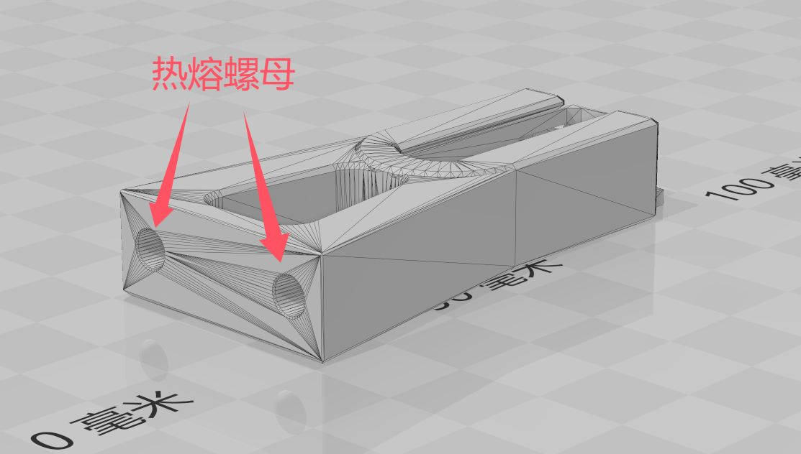

Klicky停靠坞暂未修改直接使用汪汪队射手原始版本

停靠坞为分体, 需要两个热熔螺母


停靠坞安装时可上下调节一段距离, 适配不同高度

测量喷头到微动为2.52mm, 计算得出z_offset约为2.72mm, 根据不同的装配情况可能会有出入

310尺寸机器坐标参数大致如下, 请根据实际情况进行调整
```
variable_position_preflight: [ 270, 270 ] # 【准备部署】 准备取探针的坐标点
variable_position_side:      [ 307, 270 ] # 【停靠坞边缘】 开始取探针的坐标点，速度会变慢
variable_position_dock:      [ 307, 310 ] # 【停靠坞】 取到探针的坐标点，会经行部署断言
variable_position_zstop:     [ 155, 155 ] # z限位坐标，如何使用请设置
variable_position_exit:      [ 270, 310 ] # 【停靠坞出口】 取完探针的坐标点
```

Probe offset参考
```
x_offset: -1.95
y_offset: 22.00
```

310尺寸机器三点调平坐标参考
```
points:
  20,20
  155,270
  290,20
```

310尺寸机器床网坐标参考
```
mesh_min: 10,25
mesh_max: 290,300
```
