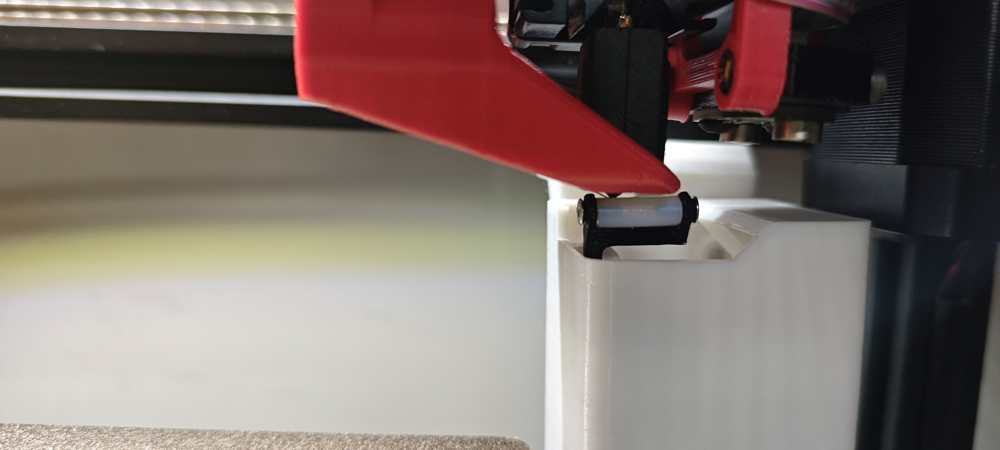

# 概要说明

思路来自FZ和胖松鼠的擦嘴模块

需要将热床向前移动5-10mm, 会有行程损失, 具体移动多少, 请根据实际情况调整

安装位置大致如下图所示, 注意不要与热床产生干涉

# 安装顺序
1. 先将三个打印件组装起来
    - 铁氟龙管按需进行切割
    - 不是很好安装, 需要细心
2. 松开热床, 将喷嘴移动到右上角

3. 安装喷嘴清理模块, 调节前后位置和高度
    - 注意喷嘴刚好能碰到铁氟龙管最佳, 打印件有弹性, 可以碰到没事

4. 重新固定热床
    - 需要注意热床归位的时候不与喷嘴清理模块产生干涉
    - 需要重新做床网补偿

5. 引入配置文件, 加热喷嘴, 调试清理效果
    - 注意原有配置是否延迟执行SET_KINEMATIC_POSITION, 若有请注释, 要不然在未归位情况下会撞机
    - 具体清理效果需要按各自情况进行调试, 调试请调用TEST_WIPE_NOZZLE宏, 
    - 调试完成后 WIPE_NOZZLE 宏也请同步修改, 该宏可读取切片参数传递的冲刷量
