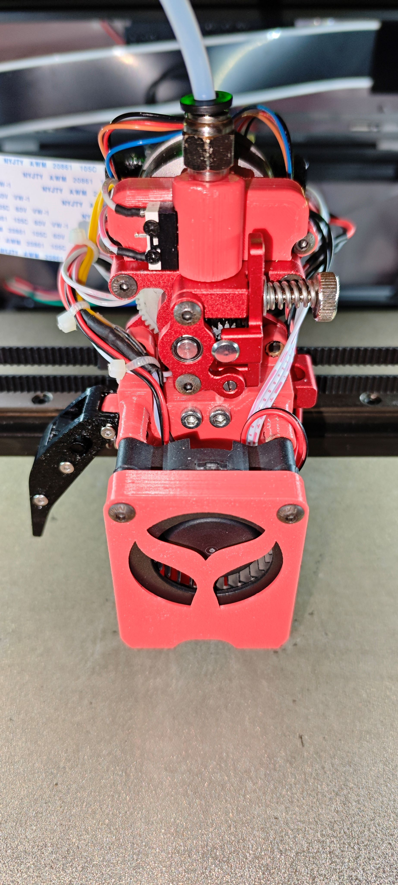

# 大鱼TT 3D打印机拓展
## 切刀拓展

参考两位B站UP以及兔子多色切刀工具头的设计

汪汪队射手: https://www.bilibili.com/video/BV19w4m1k7Eu

月下客KS: https://www.bilibili.com/video/BV1WHpde1ECP
### 特性
- 双耗材传感器, 上方传感器可根据实际需求进行添加
- 使用4号刀片, 杠杠切割更省力
- 接近开关替换为Klicky, 没有温漂更稳定
- 兼容TT原风道, 理论无行程损失(有封箱需要进行加高)

### 打印注意事项
- 建议使用ABS进行打印
- 建议使用Voron结构件打印参数进行打印
    - 顶底5层, 壁厚4, 填充40%
- 请自行加上支撑
